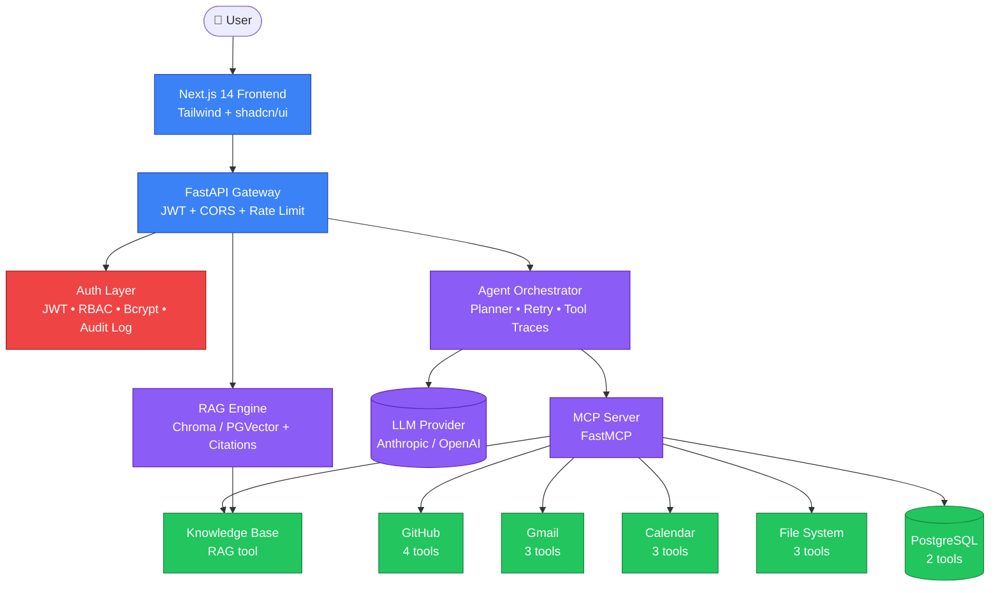

<div align="center">

# 🛡️ SentinelAI

### Secure Enterprise AI Workspace

*A self-hostable AI agent platform that securely connects employees to their internal knowledge, source code, email, calendar, and operational tools — built on the **Model Context Protocol (MCP)**.*

<br>

[](https://codespaces.new/virinchisai/sentinel-ai)

<br>


[**Live Demo (Codespaces)**](https://codespaces.new/virinchisai/sentinel-ai) · [**Architecture**](#-architecture) · [**Features**](#-features) · [**Quick Start**](#-quick-start) · [**Security**](#-security) · [**SECURITY.md**](SECURITY.md)

</div>

---

## 🚀 Try it in 30 seconds — no install needed

[](https://codespaces.new/virinchisai/sentinel-ai)

Click the badge → wait ~30 sec for setup → frontend opens automatically. Log in with **`alice`** / **`sentinel-demo`**.

> Codespaces gives you a full cloud VS Code with both servers running and ports forwarded. Free 60 hours/month on personal GitHub accounts.

<details>
<summary><b>📸 Click to preview what you'll see</b></summary>

| Page | Description |
|---|---|
| 🔐 Login | JWT-secured sign-in with bcrypt password verification |
| 💬 Chat | Multi-turn conversation, agent tool calls visualized in real time |
| 📄 Documents | Drag-and-drop ingestion into the RAG knowledge base |
| ⚙️ Settings | Live status of every MCP connector (live / mock / demo) |
| 🔍 Tool Trace | Expand any agent response to see *exactly* which tools fired, with arguments + results + latency |

</details>

---

## 💡 What is SentinelAI?

Imagine one chat interface where an employee asks *"Did anyone email about last week's incident, and is there a related GitHub issue?"* — and the AI agent figures out which internal tools to query (Gmail + GitHub), runs them in parallel, and returns a single grounded answer with citations.

That's SentinelAI. It's not a ChatGPT wrapper — it's the AI platform layer that companies actually need: **one agent, your data, your auth, your audit trail**.

### Why MCP?

The [Model Context Protocol](https://modelcontextprotocol.io/) is the emerging standard for plugging tools into AI agents. Build a Gmail tool once as an MCP server and it works in Claude Desktop, Cursor, SentinelAI, and any future MCP-aware client. Without MCP, every integration is custom glue. With MCP, **build once, use everywhere**.

---

## 🏗️ Architecture



## ✨ Features

<details open>
<summary><b>Core AI</b> — Click to expand each section</summary>

### Core AI
- Conversational enterprise assistant with multi-turn memory (SQLite-backed, session-isolated)
- RAG over enterprise documents (Markdown + PDF) with smart heading-aware chunking
- Citations on every retrieved answer
- Provider-agnostic LLM layer (swap Anthropic ↔ OpenAI via env var)
- Multi-step planning: decomposes complex queries into sub-tasks

</details>

<details>
<summary><b>🔌 MCP Connectors (18 tools across 7 servers)</b></summary>


| Connector | Tools |
|---|---|
| **GitHub** | search_issues, create_issue, comment_on_issue, search_code |
| **Gmail** | search, get_thread, draft_reply |
| **Calendar** | list_events, create_event, check_availability |
| **File System** | list_files, read_file, search (sandboxed) |
| **PostgreSQL** | query (read-only SELECT), describe_schema |
| **Knowledge Base** | query_knowledge_base (RAG) |
| **System** | echo, current_time |

</details>

<details>
<summary><b>🛡️ Security</b></summary>


- **JWT** access + refresh tokens with cryptographic signature verification
- **Role-based access control** (admin / user / viewer)
- **Bcrypt** password hashing
- **Password policy**: ≥8 chars, letter + digit/special required, common-password blocklist
- **Rate limiting**: `/auth/login` 10/min, `/auth/register` 5/min, global 100/min per IP
- **Token revocation** on logout (defense against stolen tokens)
- **HTTP security headers** on every response: HSTS, CSP, X-Frame-Options DENY, X-Content-Type-Options nosniff, Referrer-Policy, Permissions-Policy
- **Sandboxed file system** access (path-traversal protection)
- **Read-only SQL** enforcement on database queries
- **Human-approval gate** on destructive actions (create_issue, send_email)
- **Audit log** of every authenticated action (timestamped, IP-tracked)
- **CodeQL SAST** scanning on every push (Python + TypeScript)
- **Dependabot** auto-updates for outdated dependencies
- Full vulnerability disclosure process — see **[SECURITY.md](SECURITY.md)**

</details>

<details>
<summary><b>🤖 Agentic, 📚 Enterprise, 📊 Observability, 🧪 Evaluation, 🚢 Deployment</b></summary>

### Agentic
- Tool calling with retry + exponential backoff on failure
- Structured tool-call traces for every conversation
- Pluggable LLM provider abstraction
- Stateless or stateful operation

### Enterprise
- Document ingestion (Markdown, PDF, plain text)
- Semantic search via sentence-transformers + Chroma/PGVector
- Document versioning by content hash
- Connector mock-mode for demos without real OAuth

### Observability
- Structured JSON logging (structlog)
- Prometheus metrics: request latency, tool call counts, LLM latency, RAG queries, auth events
- Request ID propagation for distributed tracing
- `/metrics` endpoint ready for Prometheus scraping

### Evaluation
- Eval dataset with expected tool calls and golden answers
- Tool-call correctness scoring
- Keyword grounding metrics
- LLM-as-judge for answer quality

### Deployment
- Docker images for backend + frontend
- Docker Compose for full local stack (Postgres + pgvector + Prometheus + Grafana)
- Kubernetes manifests for production deploy
- GitHub Actions CI runs tests on every push

</details>

## 🚀 Quick Start

### 1. Clone & install
```bash
git clone https://github.com/virinchisai/sentinel-ai.git
cd sentinel-ai
python3.12 -m venv .venv && source .venv/bin/activate
pip install -e ".[dev]"
cd frontend && npm install && cd ..
```

### 2. Configure
```bash
cp .env.example .env
# edit .env: add ANTHROPIC_API_KEY or OPENAI_API_KEY
```

### 3. Ingest sample knowledge base
```bash
python -m backend.rag.ingest
```

### 4. Run
```bash
# terminal 1: backend
uvicorn backend.api.main:app --reload

# terminal 2: frontend
cd frontend && npm run dev
```

Visit **http://localhost:3000**, register an account, and start chatting.

## 📂 Repository Tour

```
sentinel-ai/
├── backend/
│   ├── api/             # FastAPI gateway: chat, auth, documents, admin routes
│   ├── auth/            # JWT, RBAC, bcrypt, audit log (SQLAlchemy)
│   ├── agents/          # LLM provider abstraction, MCP client, orchestrator, planner
│   ├── rag/             # Chunking, PDF parsing, Chroma / PGVector stores, retriever
│   ├── mcp_server/      # FastMCP server with 18 tools across 7 connectors
│   ├── observability/   # structlog, Prometheus metrics, request tracing
│   └── tests/           # pytest suite
├── frontend/            # Next.js 14 + Tailwind: login, chat, documents, settings
├── evaluation/          # Eval dataset, runner, report
├── docker/              # Dockerfile.backend, Dockerfile.frontend, docker-compose.yml
├── kubernetes/          # Production K8s manifests
├── .github/
│   ├── workflows/       # test.yml + codeql.yml (SAST)
│   └── dependabot.yml   # Weekly dep updates
└── SECURITY.md          # Vulnerability disclosure + threat model
```

## 🧪 Testing

### Local
```bash
pytest backend/tests -v       # 20 tests including 16 security regression tests
cd frontend && npm run build  # frontend
```

The security suite (`backend/tests/test_security.py`) proves every protection stays on:
- Password policy (length, common-password blocklist, character classes)
- JWT signature verification + type-mismatch rejection
- RBAC permission checks per role
- SQL injection blocking (DROP / DELETE / INSERT rejected)
- Path-traversal blocking on filesystem connector

### On GitHub
Three workflows run on every push and PR:
- **[tests](../../actions/workflows/test.yml)** — pytest on Python 3.11 + 3.12, MCP smoke test (asserts ≥18 tools register), frontend lint + build
- **[CodeQL](../../actions/workflows/codeql.yml)** — SAST for Python + TypeScript with the security-and-quality query suite
- **Dependabot** — weekly PRs for outdated pip / npm / GitHub Actions dependencies

You can also click **"Run workflow"** from the [Actions tab](../../actions) to trigger a manual run.

## 🚢 Production Deployment

```bash
docker compose -f docker/docker-compose.yml up
```

Boots the full stack: Postgres+pgvector, FastAPI backend, Next.js frontend, Prometheus, and Grafana with pre-provisioned dashboards.

For Kubernetes, apply `kubernetes/*.yaml`.

## 🛡️ Security

SentinelAI is built defense-in-depth. Every protection has a **regression test** so disabling one breaks CI.

| Threat | Mitigation |
|---|---|
| Brute-force login | Rate limit (10/min) + bcrypt slow hash |
| Password stuffing | Common-password blocklist + minimum entropy policy |
| Token theft | Short access-token expiry + revocation list + HSTS |
| XSS / Clickjacking | CSP `default-src 'none'`, `X-Frame-Options: DENY` |
| SQL injection | Parameterized queries + SELECT-only enforcement |
| Path traversal | Resolved-path containment in FileSystem connector |
| Prompt injection → destructive action | Human-approval gate, audit logging |
| Vulnerable dependencies | Dependabot weekly + CodeQL on every push |

See **[SECURITY.md](SECURITY.md)** for the full threat model and the private vulnerability-reporting process.

The repo's **[Security tab](../../security)** surfaces CodeQL findings, Dependabot alerts, and the published security policy.

## 💼 Why this matters

Most "AI app" portfolio projects are thin ChatGPT wrappers. SentinelAI is the entire enterprise AI platform stack — auth, RBAC, multi-tool agents, RAG with citations, observability, evaluation, deployment — built on the modern protocol (MCP) that Anthropic, OpenAI, and the broader ecosystem are converging on. It demonstrates the full skill set required for **Applied AI Engineering**, **AI Platform Engineering**, and **Forward-Deployed Engineering** roles at frontier AI companies.

<details>
<summary><b>📋 Resume bullet (copy-paste ready)</b></summary>

> Designed and shipped a secure enterprise AI workspace implementing the **Model Context Protocol (MCP)** to orchestrate AI agents across GitHub, Gmail, Calendar, PostgreSQL, sandboxed FS, and an enterprise knowledge base. Engineered a FastAPI gateway with **JWT auth, RBAC, audit logging, rate limiting, HSTS/CSP headers, and token revocation**, a multi-step planner-driven agent loop, a citation-aware RAG pipeline (Chroma / PGVector), Prometheus observability, a Next.js 14 frontend, a 20-test pytest suite (16 dedicated security regressions), CodeQL + Dependabot in CI, and Docker / Kubernetes deployment.

</details>

## 📈 Star History

[](https://star-history.com/#virinchisai/sentinel-ai&Date)

## 📜 License
MIT — see [LICENSE](LICENSE).

---

<div align="center">

**Built by [Virinchi Sai Athmakuri](https://github.com/virinchisai)** · [LinkedIn](https://www.linkedin.com/in/virinchisaiathmakuri/) · [Email](mailto:saivirinchi103@gmail.com)

⭐ Star this repo if you find it useful!

</div>
